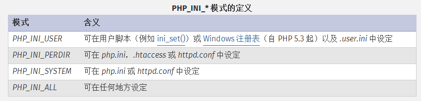

# up_load之.user.ini
## 0x00 背景
-----------------------------------------------------------------------------------------------------------------------------------
除了.htaccess构建PHP后门外，.user.ini使用的更为广泛，只要是以fastcgi运行的php都可以用这个方法,不像.htaccess那么局限。
## 0x01 .user.ini
-----------------------------------------------------------------------------------------------------------------------------------
### .user.ini到底是什么东东？？？

[这是官方给出的解释](https://www.php.net/manual/zh/configuration.file.per-user.php)
```
自 PHP 5.3.0 起，PHP 支持基于每个目录的 .htaccess 风格的 INI 文件。此类文件仅被 CGI／FastCGI SAPI 处理。此功能使得 PECL 的 htscanner 扩展作废。如果使用 Apache，则用 .htaccess 文件有同样效果。
```
不是很清楚，但是我们知道当执行PHP的时候会先调用php.ini配置文件，官方文档中还提到
```
除了主 php.ini 之外，PHP 还会在每个目录下扫描 INI 文件，从被执行的 PHP 文件所在目录开始一直上升到 web 根目录（$_SERVER['DOCUMENT_ROOT'] 所指定的）。如果被执行的 PHP 文件在 web 根目录之外，则只扫描该目录。
```
意思就是除了php.ini以外，在PHP启动的时候还会扫描其他INI文件，包括.user.ini，那么.user.ini就可以重新修改配置了。但是官方文档中还提到
```
在 .user.ini 风格的 INI 文件中只有具有 PHP_INI_PERDIR 和 PHP_INI_USER 模式的 INI 设置可被识别。 
```
.user.ini修改配置是有条件的，只有在**PHP_INI_PERDIR** 和 **PHP_INI_USER** 模式下才可以自定义配置。其中配置模式有以下四种


**结论：在fastcgi运行的PHP中，如果配置模式为PHP_INI_PERDIR或HP_INI_USER，那么.user.ini会添加或者修改PHP中的配置选项＊＊

### 
