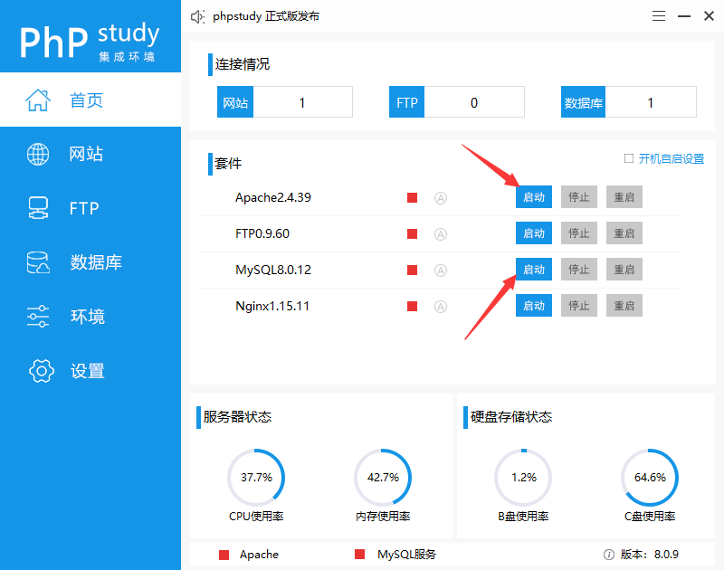
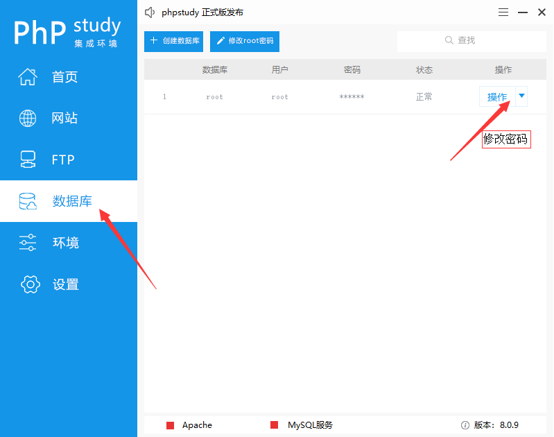
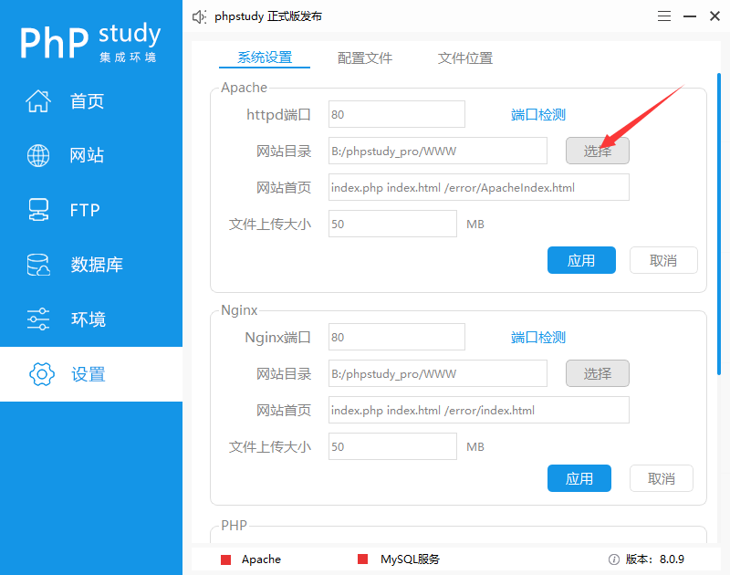
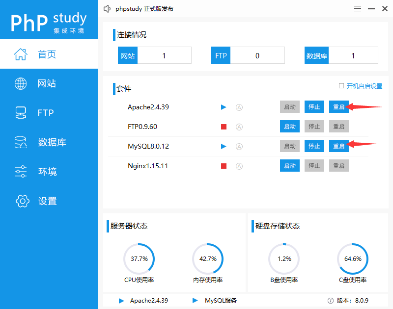
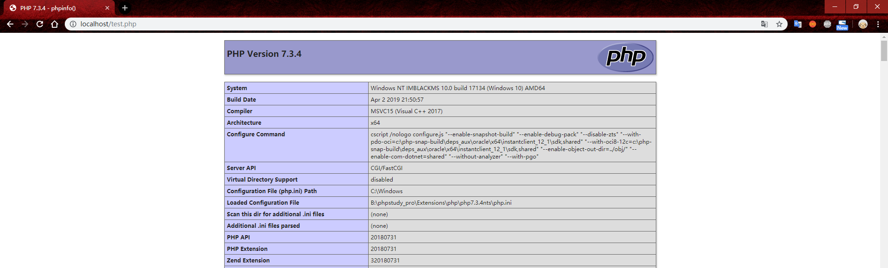
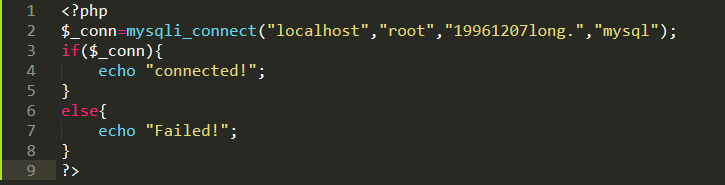

# phpstudy下载安装步骤
## 步骤一：[phpstudy官网](https://m.xp.cn/)下载好软件安装包

## 步骤二：双击打开，选择安装路径后点击“立即安装”，完成安装
## 步骤三：点击启动Apache和Mysql服务

## 步骤四：修改配置：mysql密码

## 步骤五：修改配置：网站根目录
### 默认搭建目录为~/phpstudy/www，可修改为自定义目录

## 步骤五：重启Apache服务和Mysql服务

## 步骤六：测试环境是否搭建成功：打开浏览器访问localhost

## 步骤七：测试php环境：在刚才设置的根目录下新建一个test.php

### 浏览器访问localhost/test.php

### 成功！
## 步骤八：测试MySQL环境：在刚才设置的根目录下新建一个mysqltest.php

### 浏览器访问localhost/mysqltest.php

